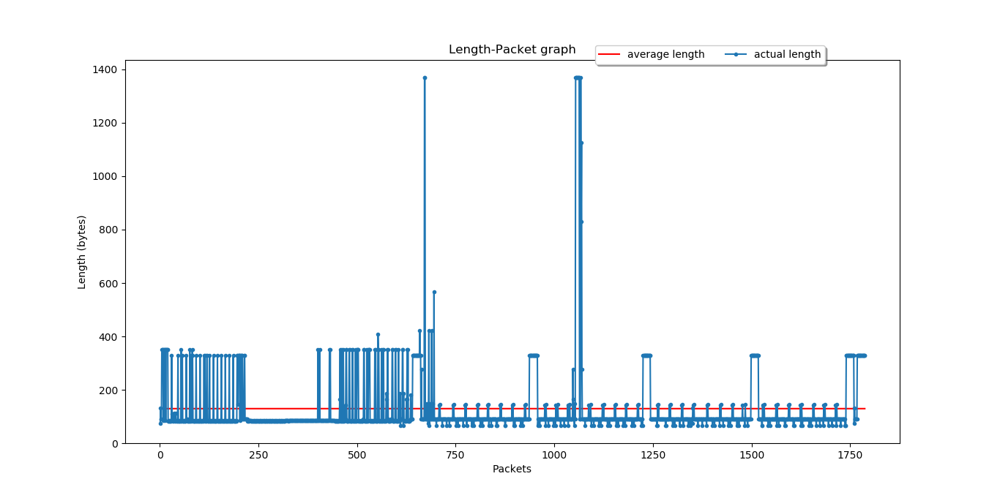
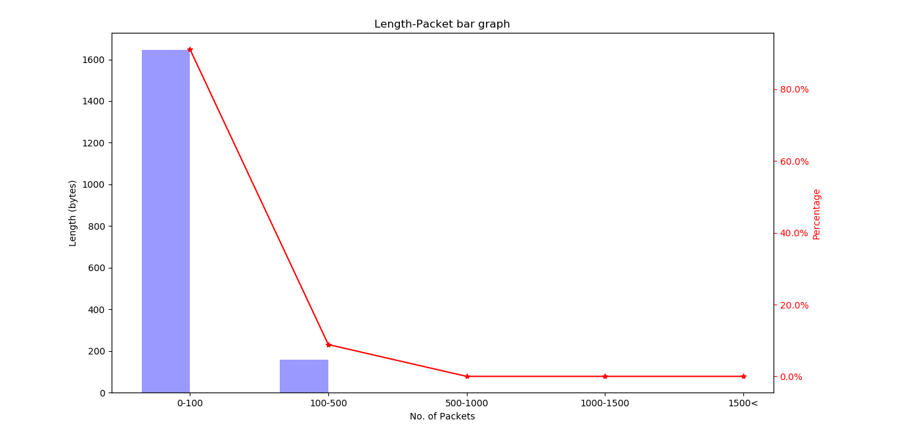

# Pcap_Graph
Read in pcap file &amp; generate graph after some analysis

It uses pyshark library to do the analysis & it uses matplotlib.pyplot to plot graph.

### Example usage:
```
Usage : python pcap_graph.py pcap-filename camera-ip
Enter a pcap filename: deleting_camera_from_android.pcapng
Enter the camera IP: 192.168.4.2
Analyzing packets...
Total packets detected with either Src or Dst IP as target_ip: 1787
```

## Generated Graphs:


